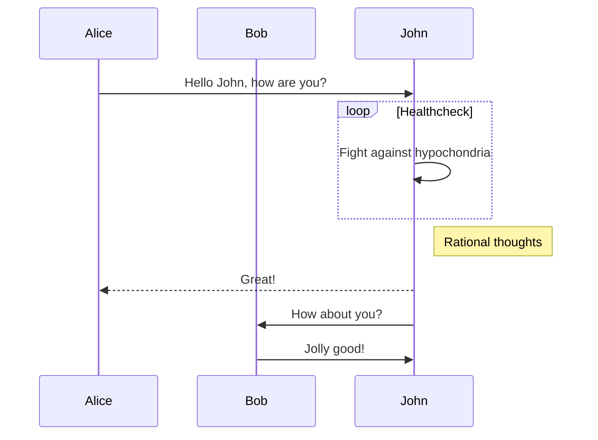
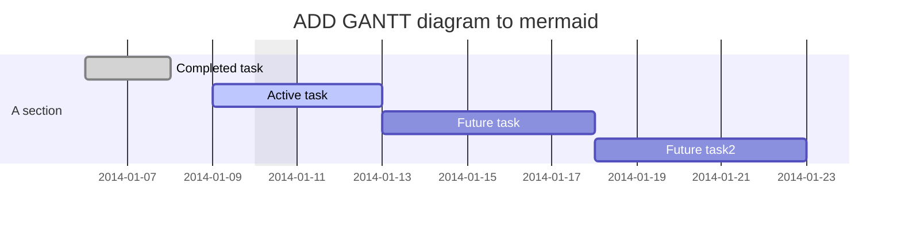
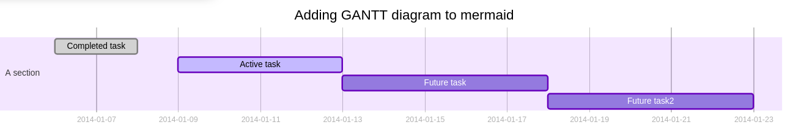
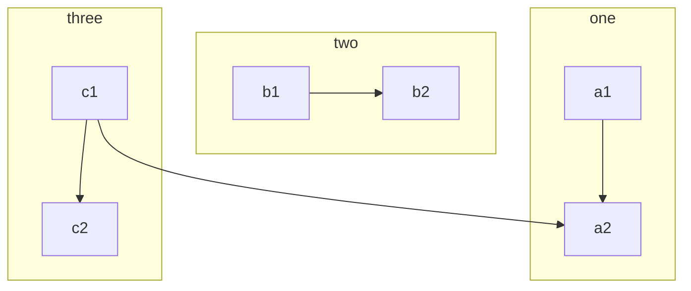
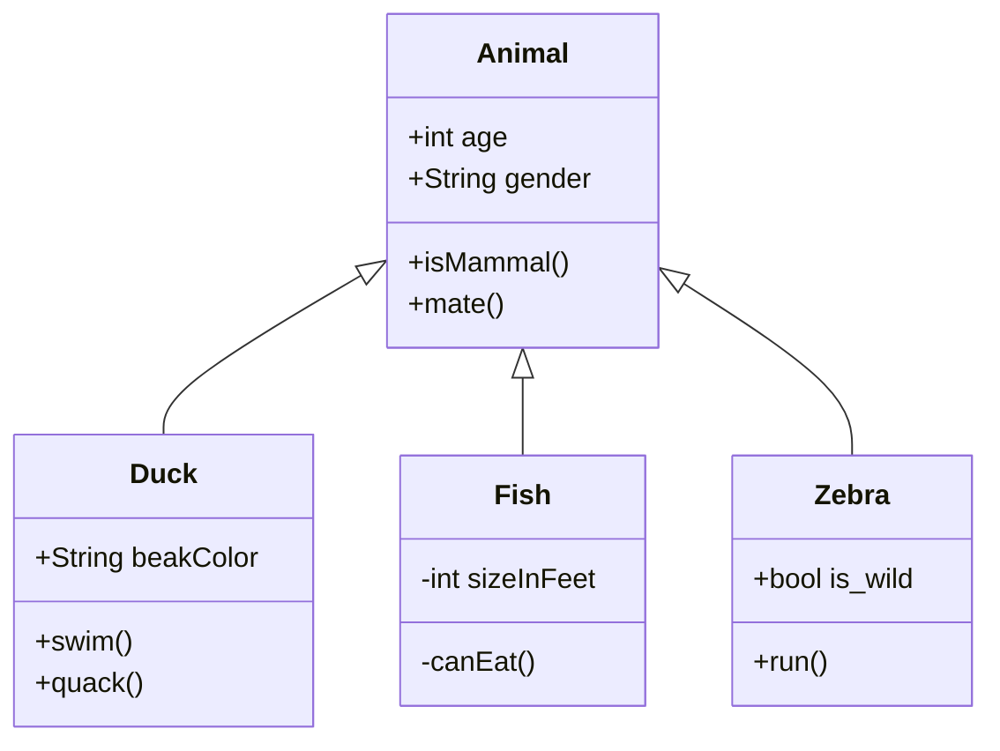
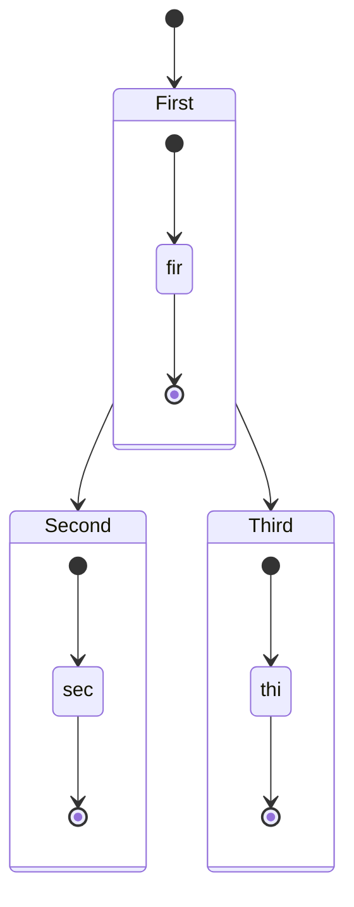
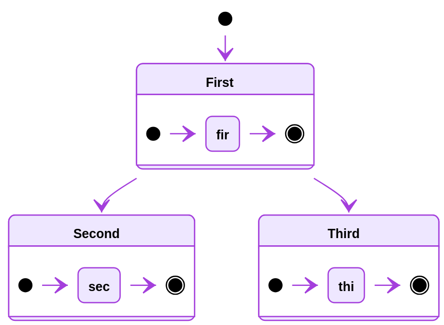
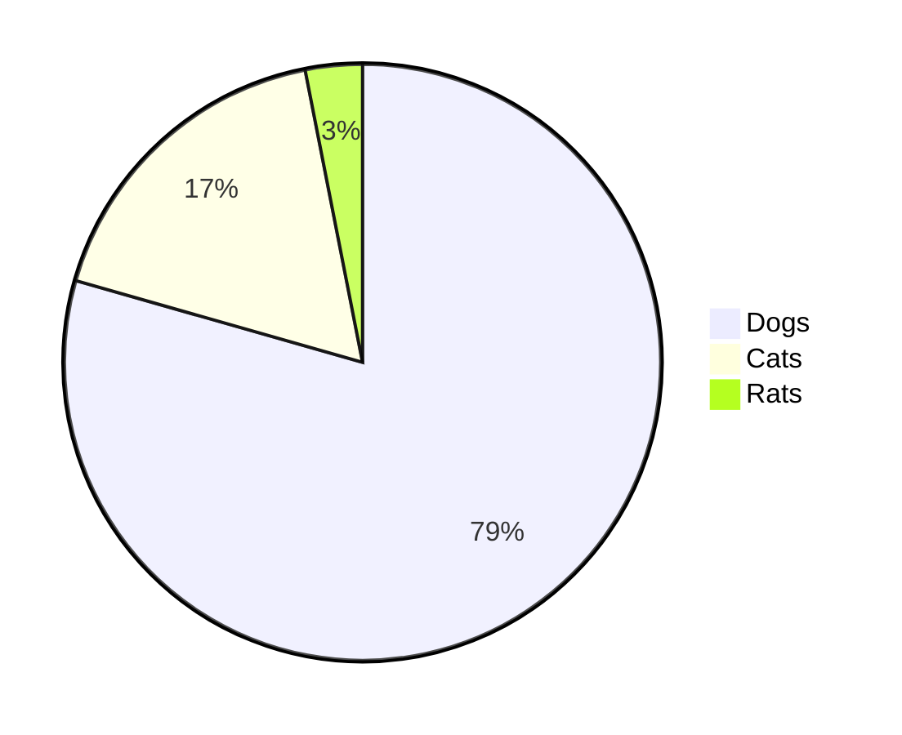
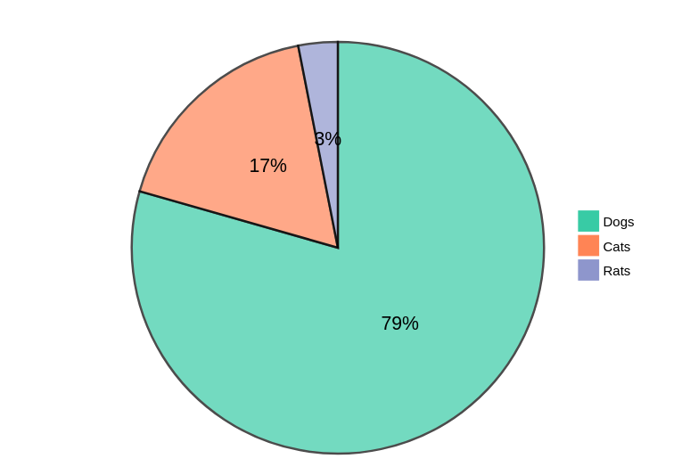

# 基于Markdown的个人博客系统

## [Get Started](get-started.md)

## 创建配置文件

创建`application-production.properties`文件，必须包含的配置项有

```shell
# 系统管理员账号和密码
# 强烈建议修改，否则将有安全隐患！
blog-system.blog-document-crud-admin.user-name=user
blog-system.blog-document-crud-admin.user-password=password

# 必须设置的前端展示项
# 否则采用默认值，需要博客系统可以运行
# 但是会展示无意义的信息

# 网站首页标题
blog-system.index-page.display-title=
# 网站首页meta标签中的中文关键词
blog-system.index-page.seo-keywords-zh=
# 网站首页meta标签中的英文关键词
blog-system.index-page.seo-keywords-en=
# 网站用途描述
blog-system.index-page.seo-descriptions=
# 网站公开域名必须展示的备案号
blog-system.index-page.recode-code=
# 联系方式信息
blog-system.index-page.contact=
```

```shell
java -jar -Dspring.config.location=D:\config\config.properties springbootrestdemo-0.0.1-SNAPSHOT.jar
```

```shell
docker run -p 9200:9200 -p 9300:9300 -e "discovery.type=single-node" docker.elastic.co/elasticsearch/elasticsearch:6.2.2
```

```shell
keytool -genkey -alias tomcat -dname "CN=Andy,OU=kfit,O=kfit,L=HaiDian,ST=BeiJing,C=CN" -storetype PKCS12 -keyalg RSA -keysize 2048 -keystore keystore.p12 -validity 365 -keypass 123456 -storepass 123456
```

## 编写博客

### 插入Latex公式

本系统能够[katex.js](https://github.com/KaTeX/KaTeX)自动检测并渲染markdown文本中的latex公式。

你只需要在markdown中插入

<pre>
```latex
\sum _{i = 0}^{10} (i^{2/3})= 25
```
</pre>

以上代码会自动被渲染为


### 插入序列图

插入序列图有两种方式，第一种使用[js-sequence-diagrams](https://bramp.github.io/js-sequence-diagrams/)自动检测并渲染序列图

<pre>
```sequence
    A->B: request
    B->C: request
    C-->A: response
```
</pre>

或者

<pre>
```seq
    A->B: request
    B->C: request
    C-->A: response
```
</pre>

以上两种方式插入的代码片段均会被渲染为


另一种是使用[mermaid](https://mermaidjs.github.io)自动检测和渲染序列图。

在markdown中插入片段

<pre>

</pre>

以上代码将会被自动渲染为


具体语法可参见[官方文档](https://mermaidjs.github.io/#/sequenceDiagram?id=syntax)

### 插入甘特图

<pre>

</pre>

将自动识别，并渲染为



### 插入流程图

使用[mermaid的flowchart语法](https://mermaidjs.github.io/#/flowchart)插入流程图。

举个例子，在markdown文件中插入片段

<pre>

</pre>

会被自动检测被渲染为


### 插入UML类图

系统使用mermaid自动检测并渲染UML类图，在markdown文件中插入符合[语法](https://mermaidjs.github.io/#/classDiagram)的片段

<pre>

</pre>

以上代码片段将会被自动识别并渲染为


### 插入状态图

在markdown文件中插入符合[状态图语法](https://mermaidjs.github.io/#/stateDiagram)的片段

<pre>

</pre>

将会被自动识别并渲染为



### 插入饼图

在markdown文件中插入符合[语法](https://mermaidjs.github.io/#/pie?id=syntax)的代码片段

<pre>

</pre>

将自动识别被渲染为饼图


### 插入思维导图

#### 使用百度脑图

百度脑图是个相当完善的思维导图生成工具，并且在线分享。为保持markdown文件的简洁，直接使用百度脑图，编辑，并在`我的文档->需要分享的脑图->选项->分享设置->复制链接`，然后在markdown文件中插入

```text
[思维导图](百度脑图的分享链接)
```
