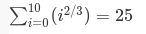
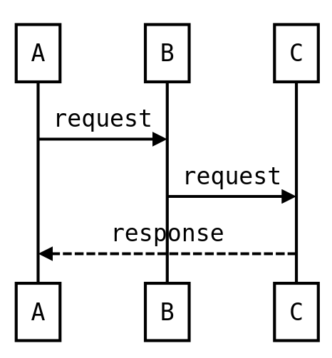
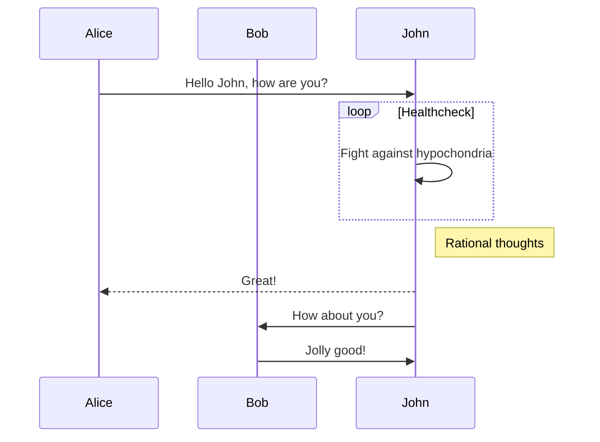
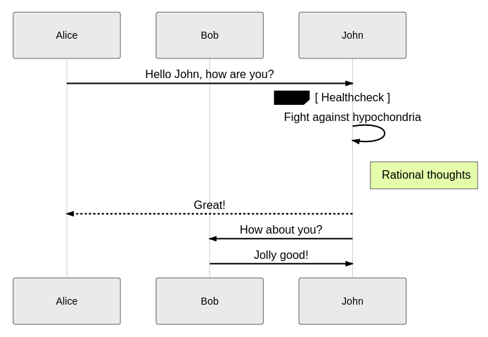
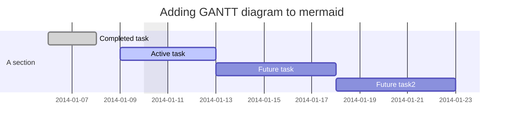
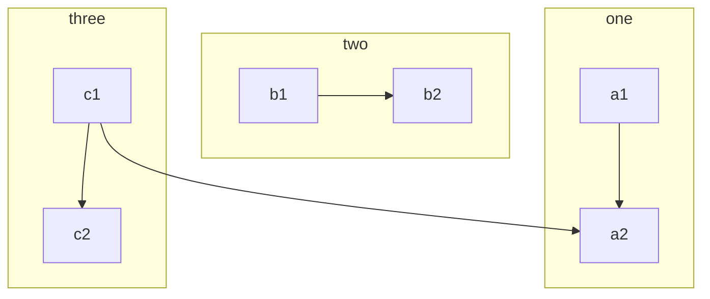
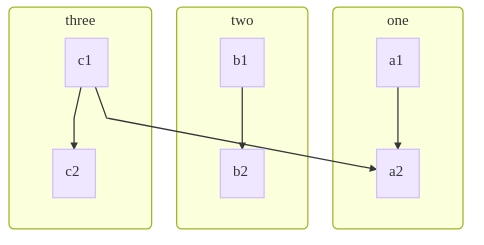
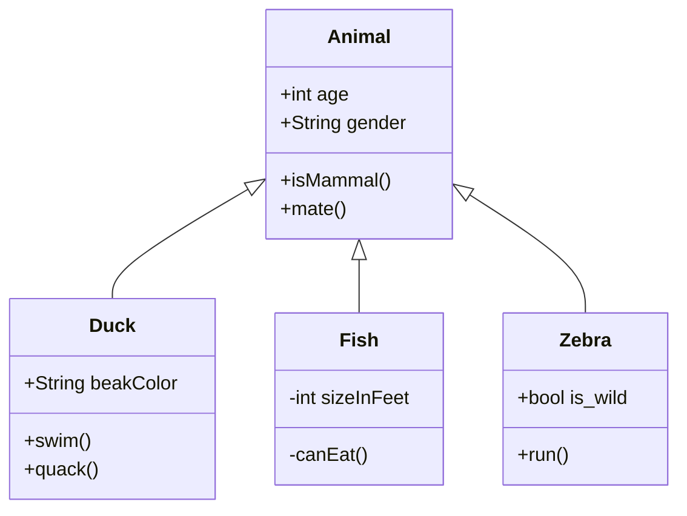
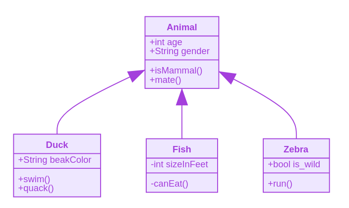

# blog-system

## 安装

创建配置文件
一个可以使用markdown在本地写作，使用git上传的个人博客系统

```shell
docker run -p 9200:9200 -p 9300:9300 -e "discovery.type=single-node" docker.elastic.co/elasticsearch/elasticsearch:6.2.2
```

```shell
keytool -genkey -alias tomcat -dname "CN=Andy,OU=kfit,O=kfit,L=HaiDian,ST=BeiJing,C=CN" -storetype PKCS12 -keyalg RSA -keysize 2048 -keystore keystore.p12 -validity 365 -keypass 123456 -storepass 123456
```

## 编写博客

### 插入Latex公式

本系统能够[katex.js](https://github.com/KaTeX/KaTeX)自动检测并渲染markdown文本中的latex公式。

你只需要在markdown中插入

<pre>
```latex
\sum _{i = 0}^{10} (i^{2/3})= 25
```
</pre>

以上代码会自动被渲染为


### 插入序列图

插入序列图有两种方式，第一种使用[js-sequence-diagrams](https://bramp.github.io/js-sequence-diagrams/)自动检测并渲染序列图

<pre>
```sequence
    A->B: request
    B->C: request
    C-->A: response
```
</pre>

或者

<pre>
```seq
    A->B: request
    B->C: request
    C-->A: response
```
</pre>

以上两种方式插入的代码片段均会被渲染为



另一种是使用[mermaid](https://mermaidjs.github.io)自动检测和渲染序列图。

在markdown中插入片段

<pre>

</pre>

以上代码将会被自动渲染为



具体语法可参见[官方文档](https://mermaidjs.github.io/#/sequenceDiagram?id=syntax)

### 插入甘特图



### 插入流程图

使用[mermaid的flowchart语法](https://mermaidjs.github.io/#/flowchart)插入流程图。

举个例子，在markdown文件中插入片段

<pre>

</pre>

会被自动检测被渲染为



### 插入UML类图

系统使用mermaid自动检测并渲染UML类图，在markdown文件中插入附合[语法](https://mermaidjs.github.io/#/classDiagram)的片段

<pre>

</pre>

以上代码片段将会被自动识别并渲染为



### 插入