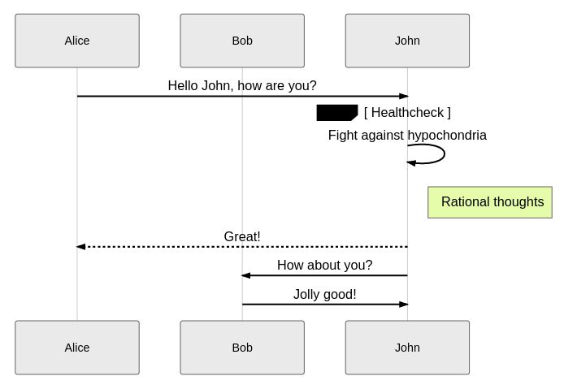
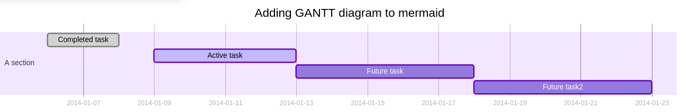
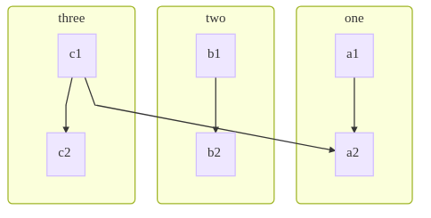
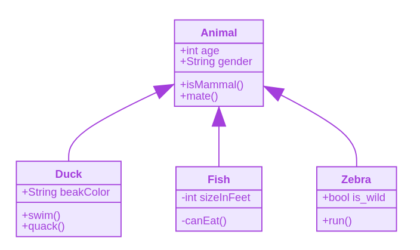
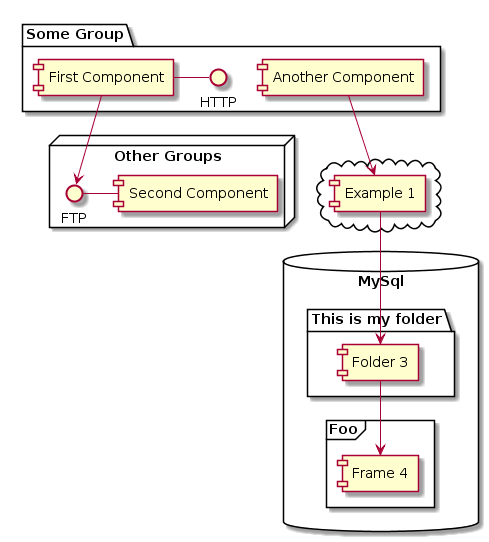

# 图表自动渲染

## 插入Latex公式

本系统能够[katex.js](https://github.com/KaTeX/KaTeX)自动检测并渲染markdown文本中的latex公式。

你只需要在markdown中插入

<pre>
```latex
\sum _{i = 0}^{10} (i^{2/3})= 25
```
</pre>

以上代码会自动被渲染为


## 插入序列图

插入序列图有多种方式，第一种使用[js-sequence-diagrams](https://bramp.github.io/js-sequence-diagrams/)自动检测并渲染序列图

<pre>
```sequence
    A->B: request
    B->C: request
    C-->A: response
```
</pre>

或者

<pre>
```seq
    A->B: request
    B->C: request
    C-->A: response
```
</pre>

以上两种方式插入的代码片段均会被渲染为


### 使用Mermaid

另一种是使用[mermaid](https://mermaidjs.github.io)自动检测和渲染序列图。

在markdown中插入片段

<pre>

</pre>

以上代码将会被自动渲染为



具体语法可参见[官方文档](https://mermaidjs.github.io/#/sequenceDiagram?id=syntax)

### 使用PlantUML语法

可以使用`PlantUML`创建流程图，具体语法参见[文档](http://plantuml.com/zh/sequence-diagram)

<pre>

</pre>

将被自动识别并渲染为


## 插入甘特图

### 使用Mermaid

<pre>

</pre>

将自动识别，并渲染为



### 使用PalntUML

系统可以使用`PlantUML`来画甘特图，根据[教程](http://plantuml.com/zh/gantt-diagram)来看，`PlantUML`还是能够满足比较精细的甘特图要求的。

使用下面的代码片段

<pre>

</pre>

将被自动检测到并被渲染为


## 插入流程图

使用[mermaid的flowchart语法](https://mermaidjs.github.io/#/flowchart)插入流程图。

举个例子，在markdown文件中插入片段

<pre>

</pre>

会被自动检测被渲染为



## 插入活动图

`PlantUML`的活动图，个人感觉，在某些场景下，要比流程图更具表现力。具体语法参见[文档](http://plantuml.com/zh/activity-diagram-beta)

示例: 在markdown文件中插入下面的片段

<pre>

</pre>

将自动识别并渲染为


## 插入UML类图

### 使用Mermaid

系统使用mermaid自动检测并渲染UML类图，在markdown文件中插入符合[语法](https://mermaidjs.github.io/#/classDiagram)的片段

<pre>

</pre>

以上代码片段将会被自动识别并渲染为



### 使用PantUML

具体语法参见[文档](http://plantuml.com/zh/class-diagram)

<pre>

</pre>

将自动被识别，并渲染为


## 插入状态图

### 使用Mermaid

在markdown文件中插入符合[状态图语法](https://mermaidjs.github.io/#/stateDiagram)的片段

<pre>

</pre>

将会被自动识别并渲染为


### 使用PlantUML

可以使用`PlantUML`插入状态图，具体语法参见[文档](http://plantuml.com/zh/state-diagram)。

举个例子，下面的代码片段

<pre>

</pre>

将自动识别并渲染为


## 插入饼图

在markdown文件中插入符合[语法](https://mermaidjs.github.io/#/pie?id=syntax)的代码片段

<pre>


</pre>

将自动识别被渲染为饼图


## 插入思维导图

### 使用百度脑图

百度脑图是个相当完善的思维导图生成工具，并且在线分享。为保持markdown文件的简洁，直接使用百度脑图，编辑，并在`我的文档->需要分享的脑图->选项->分享设置->复制链接`，然后在markdown文件中插入

```text
[思维导图](百度脑图的分享链接)
```

### 使用plantUML

<pre>

</pre>

自动检测并渲染


## 插入定时图

系统基于`PlantUML`实现了定时图功能，语法参见[文档](http://plantuml.com/zh/timing-diagram)。

示例，在markdown文件中插入下面的代码

<pre>

</pre>

将被自动识别并渲染为


## 插入组件图

基于`PlantUML`提供了组件图功能，具体语法参见[文档](http://plantuml.com/zh/component-diagram)。

示例: 在markdown文件中插入下面的代码片段

<pre>

</pre>

将自动识别被渲染为


